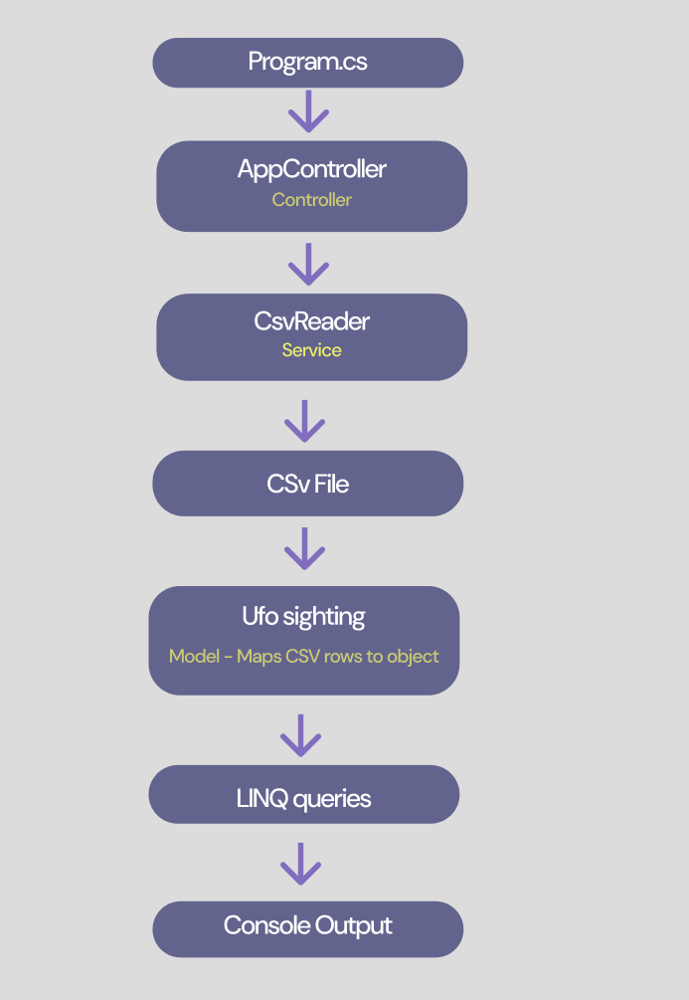

# UFO-Records-Analyzer
 
## Description
 
Simple C# MVC project for analyzing UFO sightings data using LINQ. The program reads a CSV file, converts rows into C# objects, and performs basic queries.
 
Dataset: [NUFORC UFO Sightings – Kaggle](https://www.kaggle.com/datasets/NUFORC/ufo-sightings)
 
## Features
 
- Reads `ufodata.csv` using `System.IO`
- Maps CSV rows to a `UfoSighting` model
- LINQ queries:
  - `Select()` — extracts a list of cities from the dataset
  - `Where()` — filters sightings by country (e.g. US only)
  - Date range filter — returns sightings between two dates


 
## Structure

- **Model** – represents a UFO sighting record
- **Service** – reads and parses the CSV file
- **Controller** – runs queries and prints results to the console
 

## Requirements
 
- .NET / C# 10.0+

## How to Run

```bash
dotnet run
``` 
## Flow Chart

